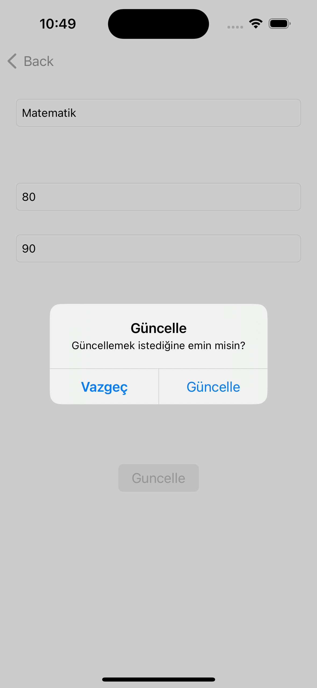
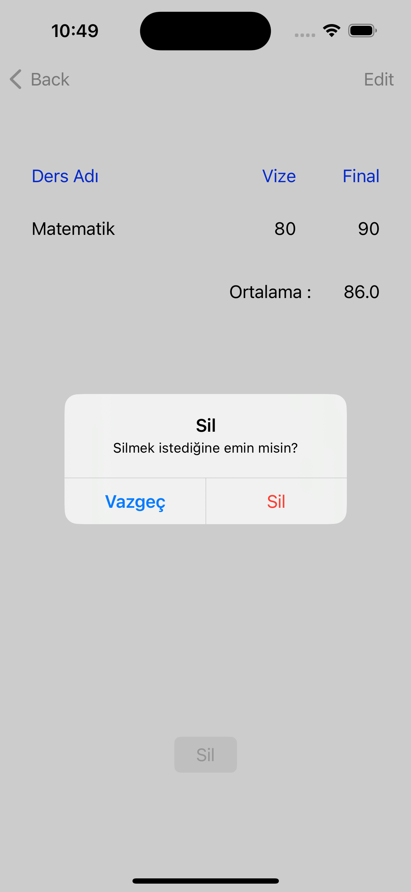
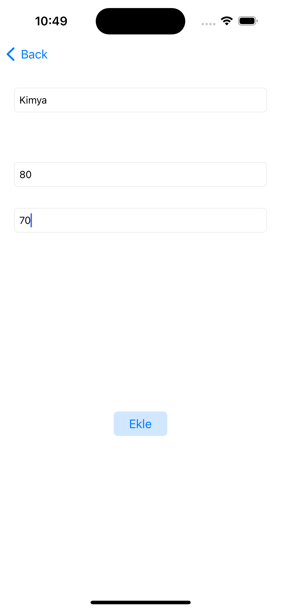
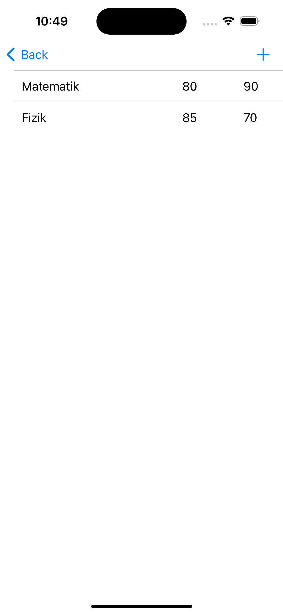
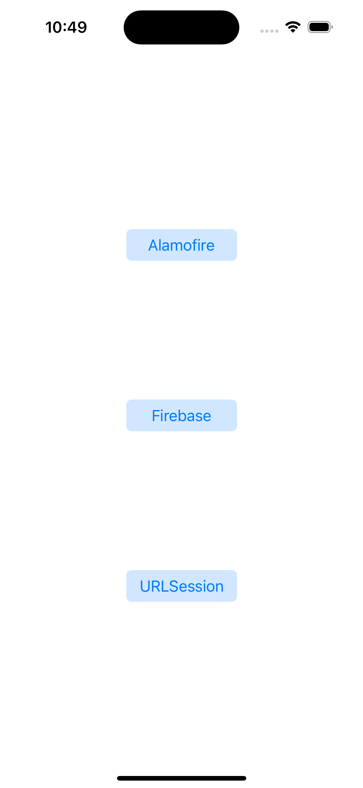

# Firebase-Alamofire-URLSession-Not-App

- İnternet tabanlı işlemler üzerine çalıştığım bu uygulama içerisinde Firebase, Alamofire ve URLSession yapılarını kullanmaya çalıştım. Başlangıç ekranında yapılan seçim sonrasında işlemlerin tamamı seçilen yönteme göre listelenmektedir ve gerekli istekler buna göre yapılmaktadır.

## Projenin Amacı ⁉️

Swift dilinde internet tabanlı işlemler için üzeirnde çalıştığım bir uygulamadır.

## Proje İçeriği 🎁

Alamofire ve URLSession ile Kasım hocanınn oluşturduğu ve tarafımıza eğitim sürecinde kullanmamız için temin ettiği webservisler üzerinden veri çekme işlemi gerçekleştirilmiştir. Bunun yanında ise Firebase Realtime Database ile kendi oluşturduğum  db den ders notlarını çeken, silme işlemi, güncelleme işlemi ve ekleme işmlemleri yapabilen bir uygulamadır.

       

